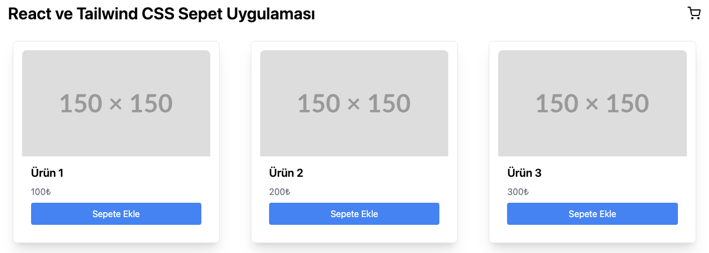
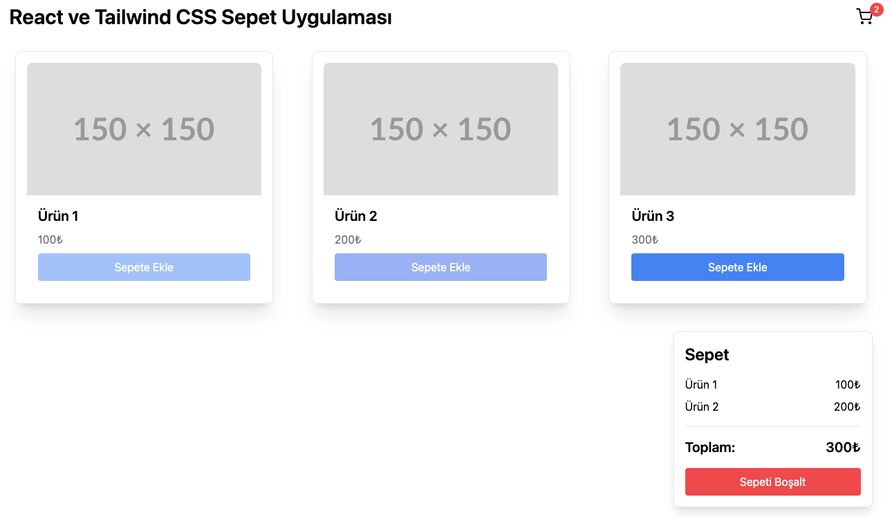
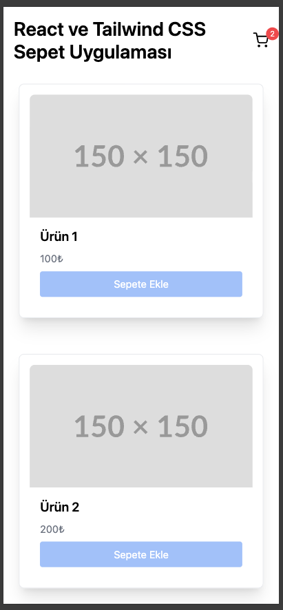

# Shopping Cart

Basit bir **alışveriş sepeti uygulaması**.  
Bu proje **React + Vite** ile geliştirilmiş olup, kullanıcıların ürünleri listelemesine, sepete eklemesine ve temel sepet işlemleri yapmasına olanak sağlayacak responsive uyumlu şekilde yapılandırılmıştır. useContext kullanılarak bileşenler arası prop geçişi kaldırılarak temiz anlaşılır ve performanslı bir yapı kurularak react tree konsepti uygulanmıştır.

---

## 🚀 Teknolojiler

Projede kullanılan teknolojiler:

- **React** – UI geliştirme
- **Vite** – Hızlı geliştirme aracı
- **JavaScript (ES6+)**
- **HTML & CSS** – Arayüz yapısı ve stil
- **Tailwind CSS** – stil ve layout
- **npm** – Paket yönetimi

---

## 📦 Kurulum

Projeyi yerel makinede çalıştırmak için:

```bash
# Repoyu klonla
git clone https://github.com/ugur-uysal/shopping-cart.git

# Proje klasörüne gir
cd shopping-cart

# Gerekli paketleri yükle
npm install

# Geliştirme sunucusunu başlat
npm run dev
```

## UI ekran görüntüleri

<p align="center">
  
  
  
  
</p>
